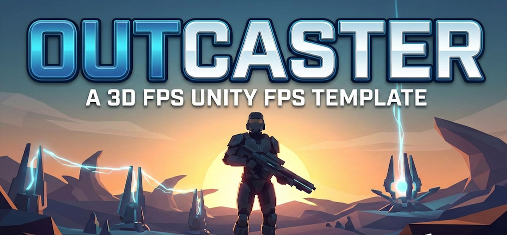

# Outcaster Reboot

Este projeto é o reboot do jogo **Outcaster**, agora migrado para uma base híbrida 3D/2.5D. A proposta é manter o feeling retro dos sprites clássicos enquanto incorporamos ambientes, armas e efeitos em 3D para dar mais profundidade à experiência FPS estilo Doom.

## Novidades Principais
- **Scripts otimizados**: arquitetura revisada com gerenciadores e singletons onde necessário, reduzindo redundância e facilitando manutenção.
- **Armas e combate**: suporte tanto a armas hitscan quanto projéteis, com animações rápidas (recuo + muzzle flash 2.5D) e gerenciamento centralizado.
-**Billboards dinâmicos**: inimigos e itens continuam em 2.5D, mas agora com billboards que se ajustam dinamicamente à câmera.
- **Cenários 3D**: ambientes totalmente modelados em 3d mas utilizando sprites para elementos dinâmicos, mantendo o estilo visual original.
- **Elementos 3D expandidos**: cenários, armas e efeitos visuais podem usar modelos 3D, convivendo com inimigos/itens em 2.5D via billboards para preservar o estilo clássico.

---
